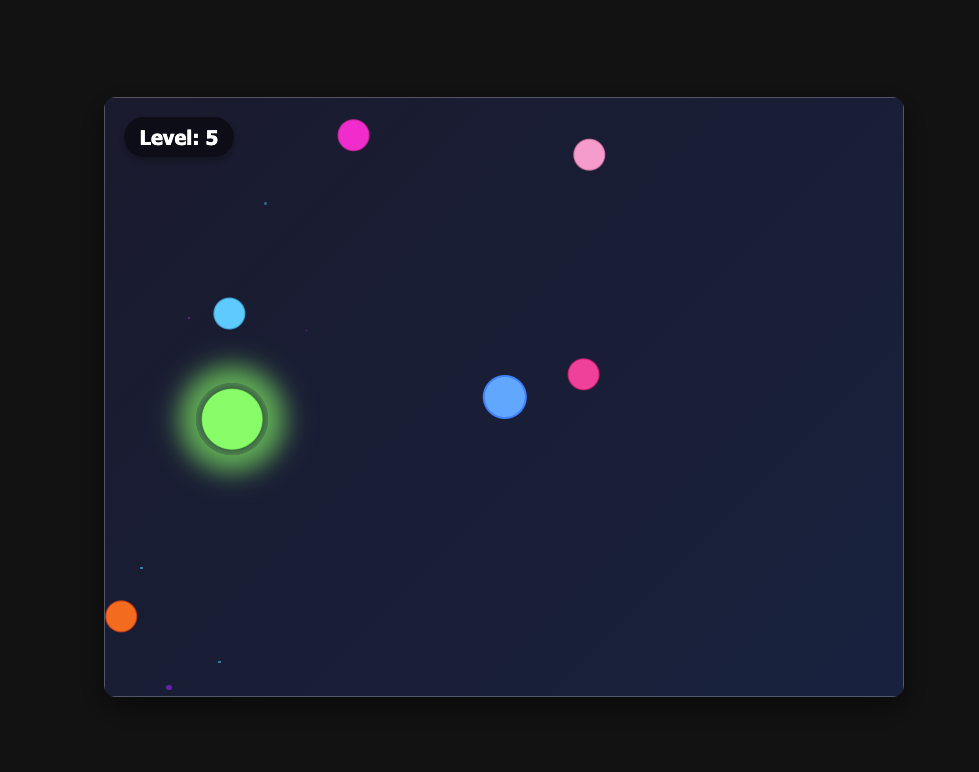

# Jack's Bouncy Game

A simple but addictive physics-based browser game built with Matter.js.

## Game Description

In Jack's Bouncy Game, you control a ball using the arrow keys, navigating through a field of bouncing hazard balls to reach a target. The game features increasing difficulty with each level:

- **Objective**: Move your ball to the target to complete each level
- **Controls**: Arrow keys to move your ball
- **Twist**: 
  - Up/Down arrows make hazard balls move faster
  - Left/Right arrows reverse the direction of hazard balls
- **Progression**: Each level adds one more hazard ball and moves the target to a random location

## Development Plan

### Phase 1: Basic Setup and Environment
- Set up project structure and dependencies
- Create basic HTML, CSS, and JavaScript files
- Initialize Matter.js and create a basic canvas
- Implement a simple game loop

### Phase 2: Core Game Mechanics
- Create player ball with keyboard controls
- Add boundary walls to contain the game
- Implement target object
- Add collision detection between player and target
- Create level completion logic
- Implement "Level Complete" message with "Press SPACE to continue" (game pauses until you continue)
- Implement level counter

### Phase 3: Hazard Mechanics
- Add bouncing hazard balls
- Implement collision detection between player and hazards
- Program the special effects:
  - Speed increase when up/down arrows are pressed
  - Direction reversal when left/right arrows are pressed

### Phase 4: Game Flow, UI, basic enhancements
- Create start screen
- Add game over screen when player collides with hazards
- Add physics for collisions between hazard balls (so they bounce off each other)
- Add particle effects for collisions between hazard balls

### Phase 6: Deployment
- Deploy the game online

## Technologies
- HTML5
- CSS3
- JavaScript
- Matter.js physics engine

## How to Run Locally
1. Clone this repository
2. Open `index.html` in your browser
3. Use arrow keys to play

## License
MIT

## Credits
Created by Jack Tattersall, with a little help from our friends Claude and Cursor